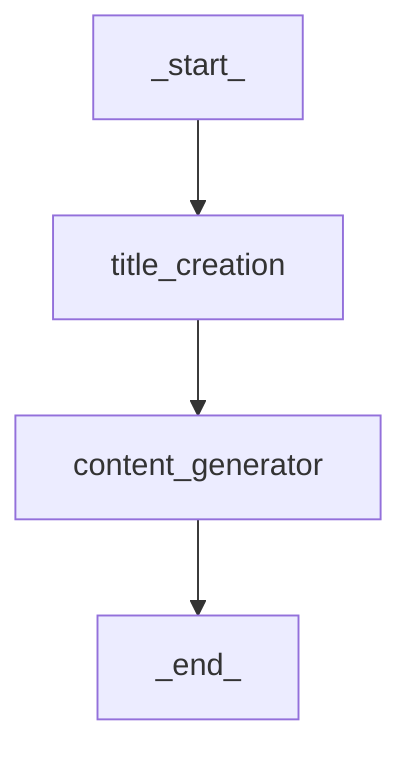
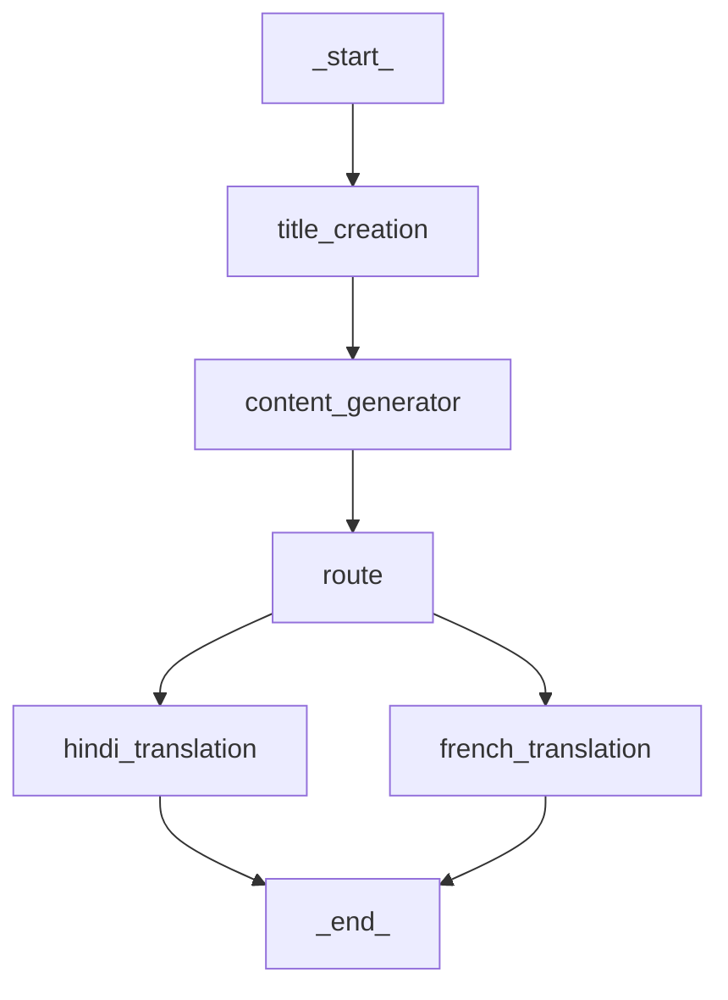

# 🧠 LangGraph Blog Generation App (Multi-Language Agentic AI)

This project demonstrates a modular **Agentic AI** system using **LangGraph** to generate blogs from a given topic. The system supports both **basic blog generation** and **multi-language translation workflows**, allowing content creation in English, Hindi, or French.

LangGraph enables us to design flexible, stateful workflows using language model agents — ideal for structured, multi-step tasks like content generation.

---

## 🗂️ Project Variants

### 1. 📝 Basic Blog Generation

- Input: Topic
- Output: Blog content (English)
- Workflow:
  - `title_creation`: Generates a suitable blog title.
  - `content_generator`: Creates a blog body based on the title.

### 2. 🌐 Blog Generation in Different Languages

- Input: Topic
- Output: Blog content in **Hindi** or **French**
- Workflow:
  - `title_creation`: Generates the blog title.
  - `content_generator`: Creates a blog body in English.
  - `route`: Selects translation path based on target language.
  - `hindi_translation` / `french_translation`: Translates content accordingly.

---

## ⚙️ Workflow Diagrams

### 📄 Basic Flow `{Topic}`


### 🌍 Multi-Language Flow


---

## 📦 Setup Instructions

### 1. Clone the repository

```bash
git clone https://github.com/yourusername/langgraph-blog-gen.git
cd langgraph-blog-gen
```

### 2. Install dependencies

```bash
pip install -r requirements.txt
```

### 3. Set up environment

Create a `.env` file:
```env
OPENAI_API_KEY=your_openai_key
```

### 4. Run the app

#### English blog:
```bash
python run_basic.py --topic "AI in Healthcare"
```

#### Translated blog:
```bash
python run_multilang.py --topic "AI in Healthcare" --language "hindi"
```

---

## 📁 File Structure

```
.
├── agents/
│   ├── title_creator.py
│   ├── content_generator.py
│   ├── translator.py
│   └── router.py
├── graphs/
│   ├── basic_graph.py
│   └── multilang_graph.py
├── main/
│   ├── run_basic.py
│   └── run_multilang.py
├── .env
├── requirements.txt
└── README.md
```

---

## 🧠 Key Technologies

- **LangGraph**: State machine framework for LLM agents
- **LangChain**: LLM orchestration and memory management
- **OpenAI GPT-4o**: Content generation and translation
- **Python**: Core logic and CLI interface

---

## ✨ Future Improvements

- Add support for more languages via external APIs
- Integrate Grammarly/Ginger API for grammar refinement
- Deploy via a Streamlit or Gradio interface
- Add blog summary generator

---

## 📝 License

This project is licensed under the MIT License.
